#### CI/CD

- [Иницилизация проекта, создание виртуальной машины и подключение к ней](#иницилизация-проекта-создание-виртуальной-машины-и-подключение-к-ней)
- [Docker, docker-compose](#docker-docker-compose)
- [Запуск и подготовка самого проекта](#запуск-и-подготовка-самого-проекта)
- [gitlab, gitlab-runner](#gitlab-gitlab-runner)
- [.gitlab-ci.yml](#gitlab-ciyml)

# Иницилизация проекта, создание виртуальной машины и подключение к ней

В начале я создал vue приложение с таким содержимым

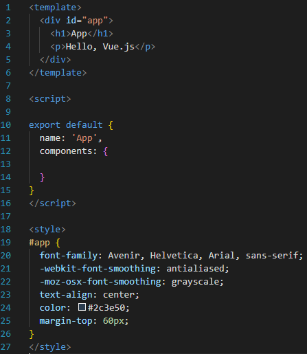

Теперь потребуется создать новую виртуальную машину на ubuntu 22.04 и пробросить все нужные порты как на скриншоте для работы ssh, так же для доступа к gitlab интерфейсу и серверу vue.

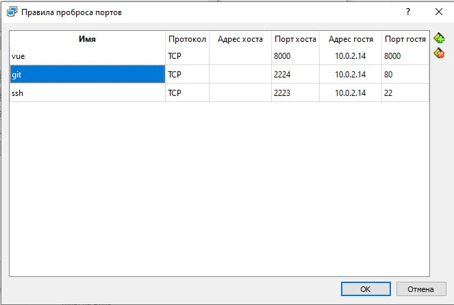

Теперь для подключения по ssh 

```
ssh user@localhost -p 2223
```

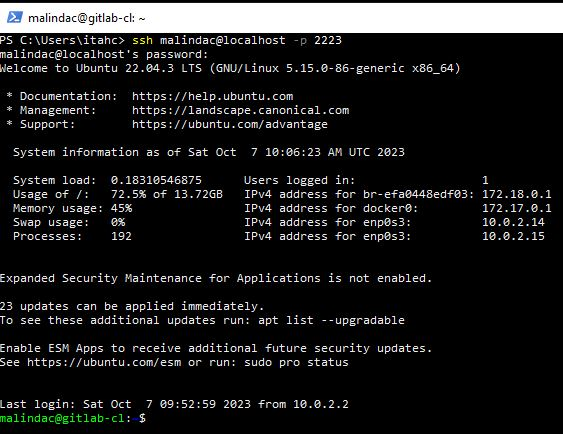

#  Docker, docker-compose

Установить docker docker-compose

```
$ sudo apt-get install docker docker-compose -y
```

Дать докеру все необходимые права
```
sudo usermod -aG docker $USER
newgrp docker
sudo systemctl restart docker
```
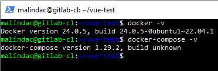
# Запуск и подготовка самого проекта
Сначала я решил загрузить проект на машину и запустить через докер, для проверки работоспособности. 

Для этого сначала нужно склонировать репозиторий и удалить лишние файлы

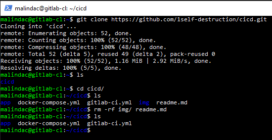

Я добавил в vue приложение Dockerfile
```
FROM node:18

WORKDIR /app

COPY package*.json ./

RUN npm install

COPY . .

CMD ["npm", "run", "serve"]
```

и docker-compose.yml в корень проекта

```
version: '3'
services:
  vue-app:
    build:
      context: ./app
      dockerfile: Dockerfile
    ports:
      - "8000:8080"
```

Итоговая  структура проекта:

```
app/public
app/src
app/*.*
app/Dockerfile
.docker-compose.yml
```

в корне проекта нужно запустить 'docker-compose up -d', после чего наше приложение начнет запускаться  и будет доступно по адресу localhost:8000 с основной системы

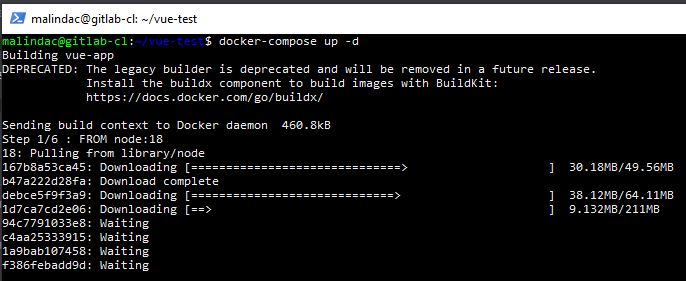
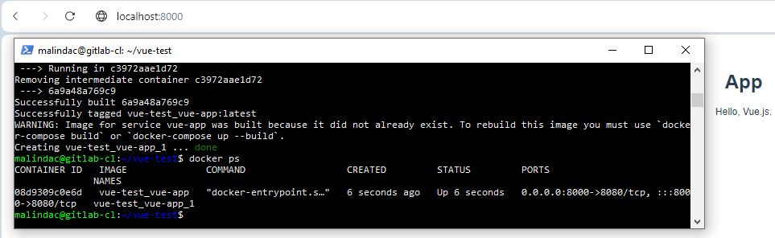

# gitlab, gitlab-runner
Для развертки нужно установить клиент gitlab, gitlab-runner,  лучше сделать это через докер, но я поставлю их через deb пакеты 

gitlab

```
$ curl https://packages.gitlab.com/install/repositories/gitlab/gitlab-ee/script.deb.sh | sudo bash
$ EXTERNAL_URL="http://localhost" apt-get install gitlab-ce
```
После успешной установки гитлаб будет доступен с основной  системы по адресу 'http://localhost:2224', для авторизации использовать логин  root, пароль будет находиться в файле /etc/gitlab/initial_root_password

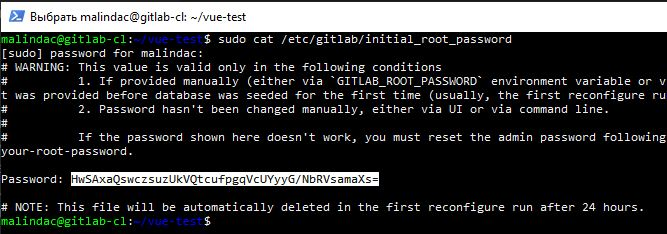
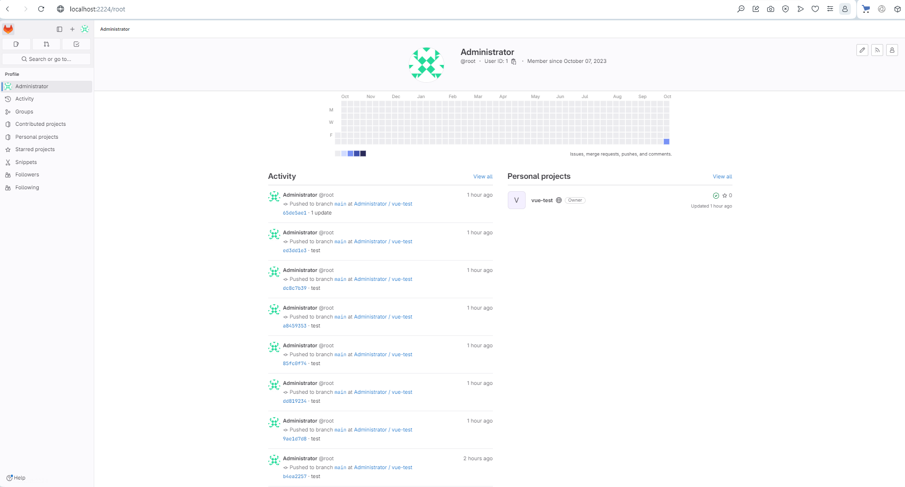

Для подключения раннера нужно создать его

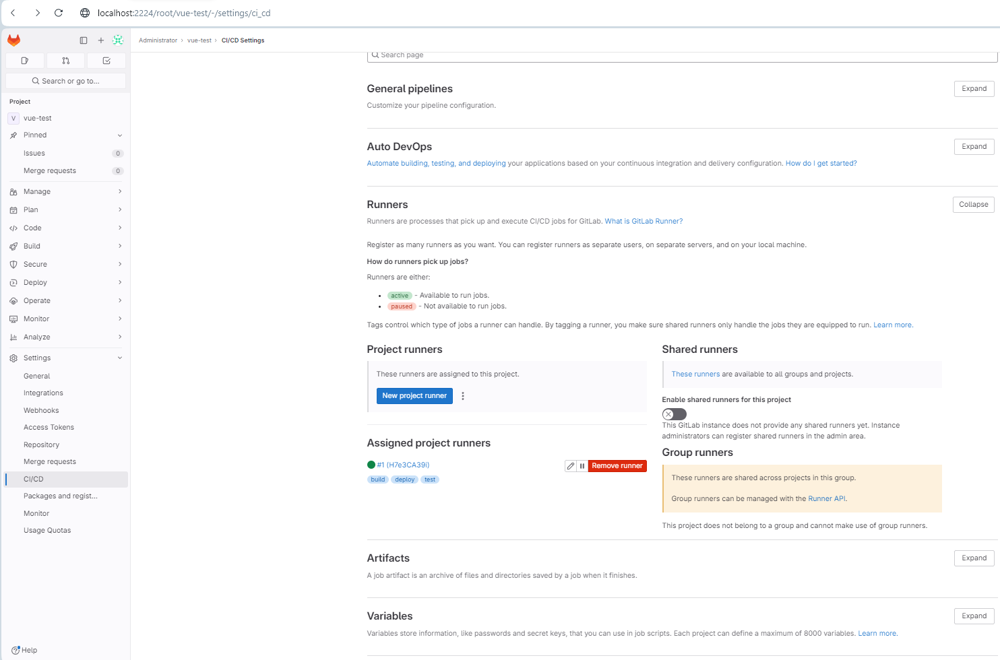

После создания получим информацию такого вида и команду для запуска регистрации  gitlab-runner. 

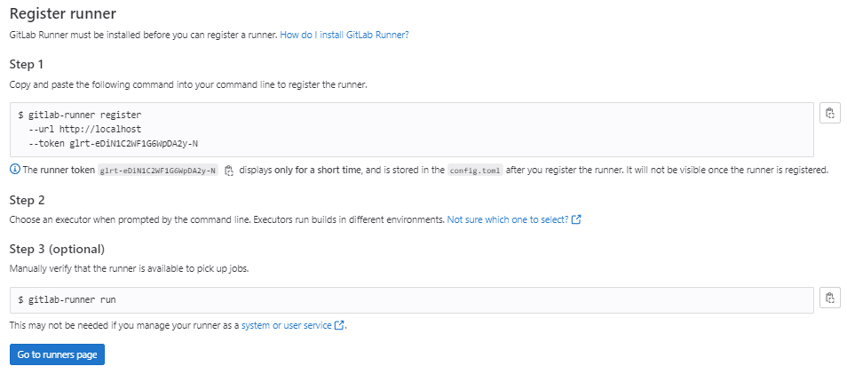

Теперь нужно установить на виртуальную машину gitlab-runner и дать ему права

```
$ curl -L "https://packages.gitlab.com/install/repositories/runner/gitlab-runner/script.deb.sh" | sudo bash
$ sudo apt-get install gitlab-runner
$ sudo usermod -aG docker gitlab-runner
$ sudo gitlab-runner restart
```
После чего ввести команду sudo gitlab-runner register и следовать инструкции или скопировать  команду, которую нам дал gitlab.

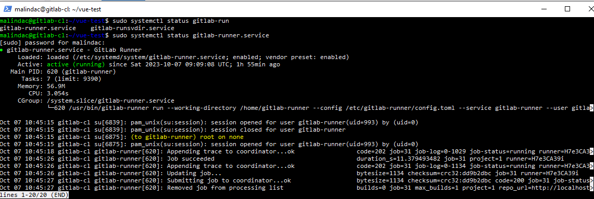

# .gitlab-ci.yml

Теперь необходимо создать репозиторий на нашем сервере с гитом и поместить в корень новый файл .gitlab-ci.yml, который будет отвечать за процесс ci/cd

```
stages:
  - build
  - deploy

build:
  stage: build
  tags:
    - build
  script:
    - docker-compose build
  when: always

deploy:
  stage: deploy
  tags:
    - deploy
  script:
    - docker-compose up -d
  when: on_success
gitlab-runner
```


Проект можно загрузить на основной компьютер для удобства командой

```
git clone http://localhost:2224/root/vue-test.git
```

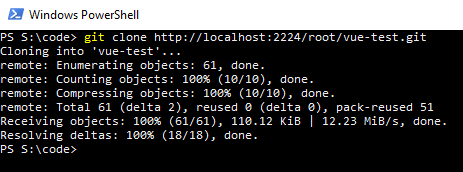

Вот так выглядит итоговый репозиторий

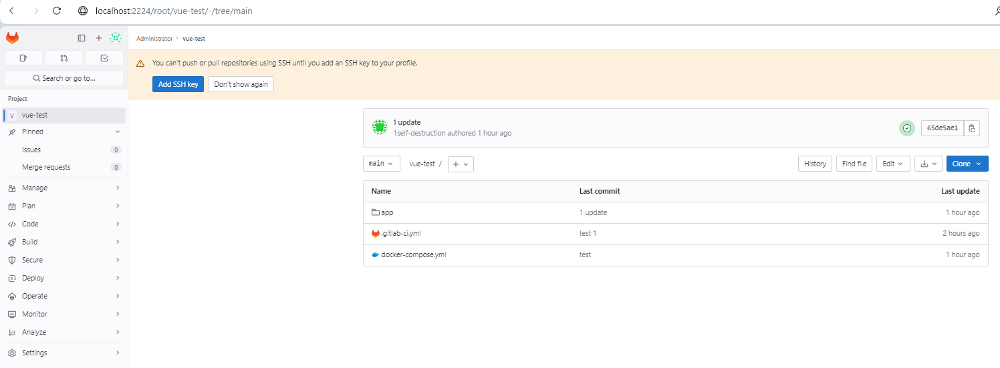


После изменения кода в самом приложении и пуша будет произведена сборка и запуск, приложение будет доступно так же по адресу http://localhost:8000

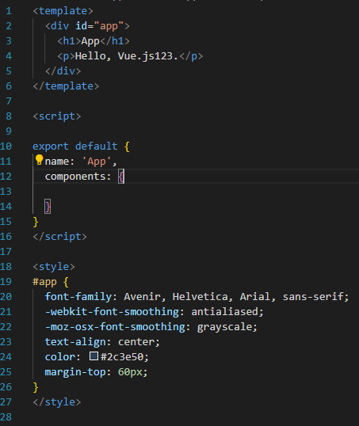
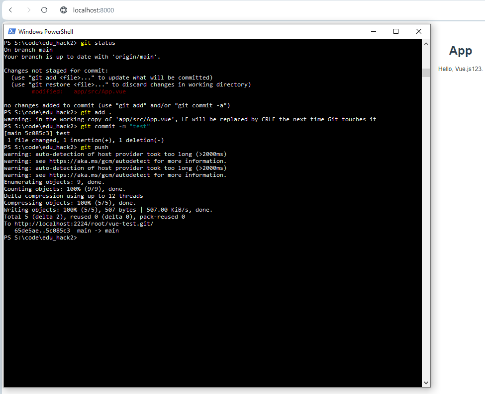

Так же мы можем увидеть сам пайплайн

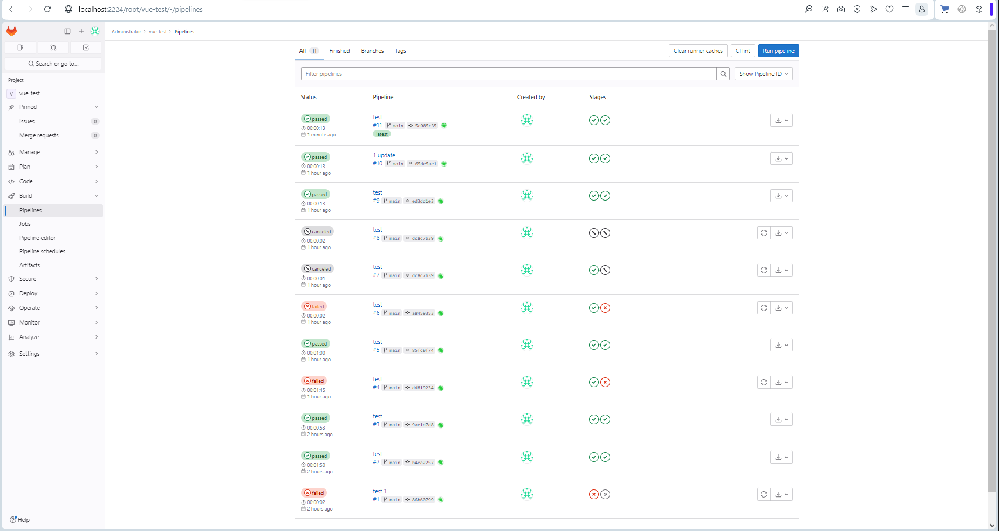


Теперь при изменении приложения обратно и повторном пуше увидим  что изменения так же подтянулись  после выполнения пайплайнов.

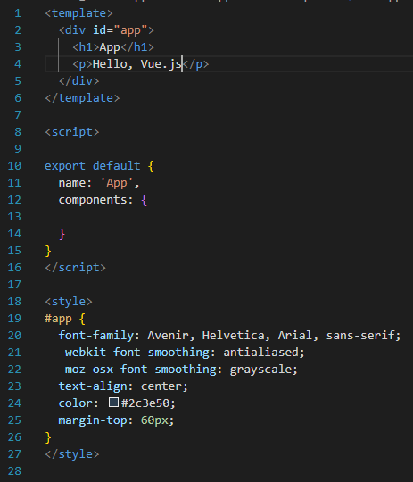
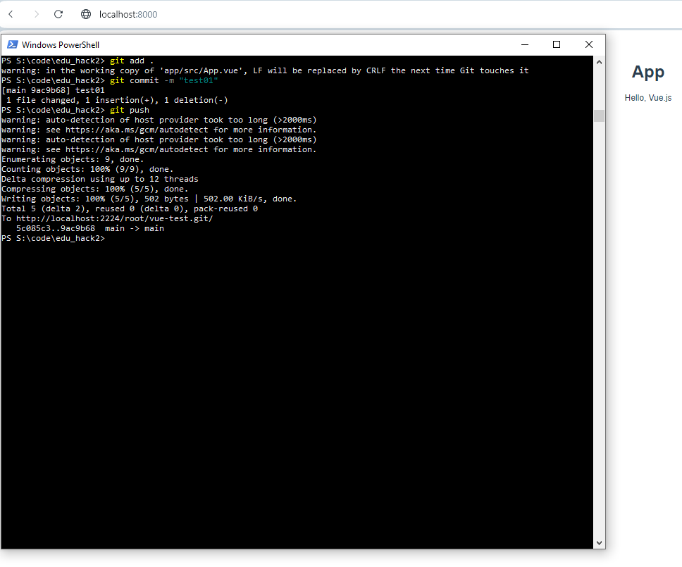
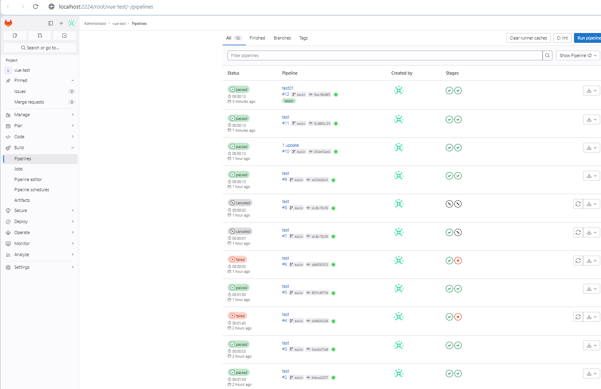

Конец